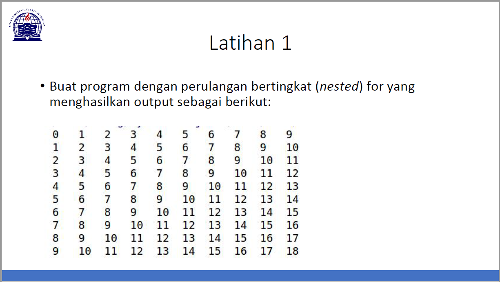
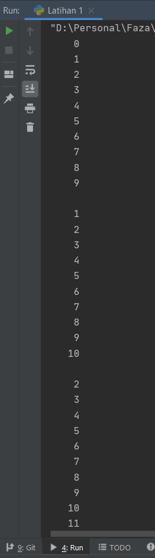
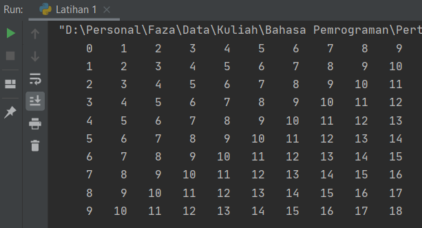

# Pertemuan 7

**Nama    : Faza Ardan Kusuma<br>
NIM     : 312010001<br>
Kelas   : TI.20.B1**

## Latihan 1

Di latihan 1 kali ini, tugasnya disuruh membuat program perulangan bertingkat (nested). Untuk perulangan saya menggunakan syntax ***for***<br>

Source code latihan 1
```python
a = 10
b = 10

for x in range(a):
    for y in range(b):
        z=x+y
        print("{0:5}".format(z), end="")
    print()
```

Penjelasan :
* ***a & b***, untuk menentukan jumlah baris(a) & kolom(b)
* ***for x in range(a)***, untuk baris
* ***for y in range(b)***, untuk kolom
* ***z=x+y***, untuk rumus penjumlahannya 
* ***print("{0:5}".format(z), end="")***
    * ***{0:5}***, untuk jarak antar kolom
    * ***format(z)***, untuk output rumus
    * ***end=""***, membuat berjejer seperti kolom, bila tidak menggunakan ***end=""***, maka outputnya akan jadi seperti ini<br>
    

Hasil dari source code diatas adalah<br>

